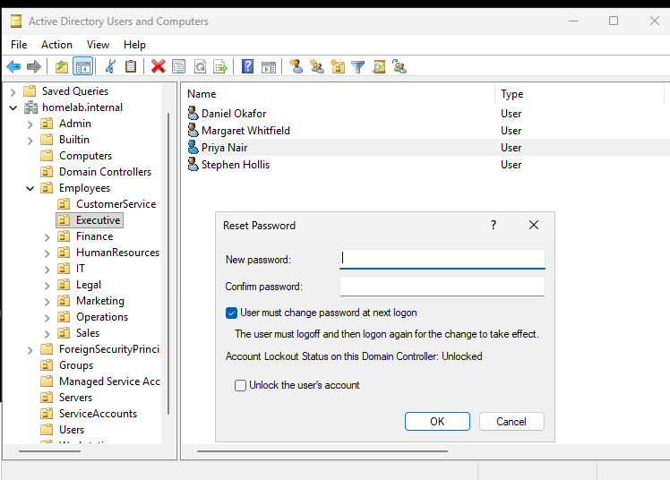
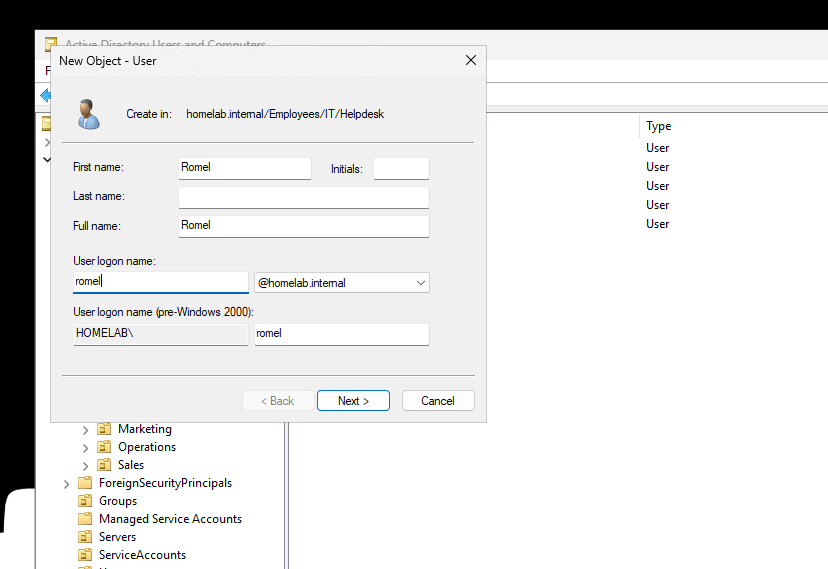
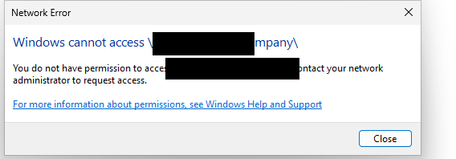
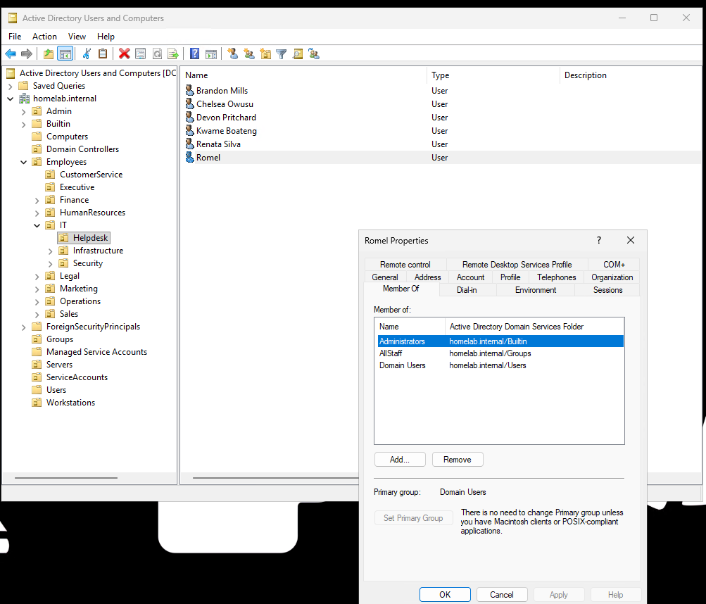
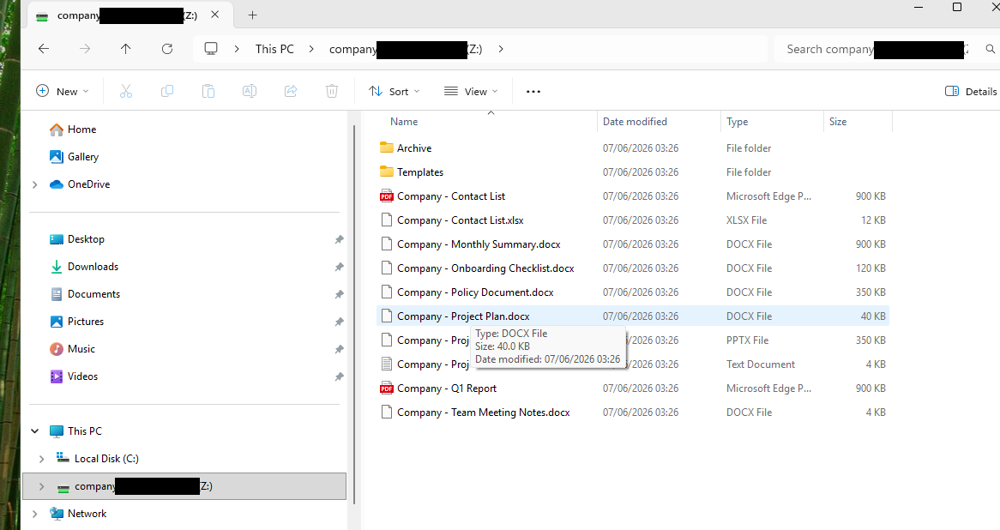

# Active Directory Lab: Tiered "Fakelab Inc." Domain

A Windows Server 2025 Active Directory environment built from scratch to practise real IT support and SOC analyst work. It models a fictional company, **Fakelab Inc.**, designed around Microsoft's tiered administration model and mapped to current NIST guidance, with the entire company provisioned by an idempotent PowerShell script.

> **Note:** This is a closed practice lab. Company, staff and credentials are fictional. Lab passwords appear as placeholders below, they are deliberately weak and shared because nothing real is at stake; the modernisation roadmap explains exactly why production must differ.

## Environment

| Component | Detail |
|---|---|
| Domain | `homelab.internal` |
| Domain controller | `DC01` (Tier 0) |
| File server | `FS01` (Tier 1) |
| Client | Windows 11, used to log in as any employee |
| Directory | ~35 staff across 9 departments; IT staff hold paired accounts |
| Build | `Build-TieredCompanyLab.ps1` (idempotent; teardown one-liner included) |

Hosted on Proxmox (UEFI + TPM 2.0 VMs). The file role sits on a separate member server rather than the domain controller, mirroring real corporate separation, everyday users reaching shares never touch the Tier 0 machine.

## The tiered model and why it matters

Assets and the accounts that manage them are sorted into three tiers by blast radius:

- **Tier 0, the crown jewels.** Domain controllers and identity itself. These accounts are only ever used on Tier 0 systems.
- **Tier 1, servers & applications.** The systems that run the business. Tier 1 admins never log on to ordinary workstations.
- **Tier 2, user devices.** Staff laptops/desktops. Helpdesk and desktop support live here and have no business on servers.

The model exists to break **lateral movement**, the classic attack where someone compromises one ordinary laptop, finds a powerful admin credential cached on it, and pivots to owning everything. Tiering ensures powerful credentials never touch low-trust machines (the "clean source" principle: anything that controls an asset must be at least as trusted as that asset).

**Paired accounts** are the habit this teaches. Every IT staff member has two logins:

- a normal account (e.g. `brandon.mills`) for email, browsing and their own laptop, no special powers
- a separate admin account (e.g. `adm-brandon.mills`), placed in the correct tier, used only for administrative work

If the normal account is phished, the attacker gets nothing useful; the powerful account is never exposed where attacks begin.

## Directory design

The OU structure is organised around **administration and policy**, not the org chart, a department only gets its own OU if it genuinely needs its own policy or delegation:

- **Object-type top level:** `Employees`, `Workstations`, `Servers`, `Groups`, `ServiceAccounts`
- **Departments nested** under `Employees` (the people axis)
- **A separate tiered admin tree**: `Admin\Tier0|Tier1|Tier2`, for all admin accounts (the security axis)

The two axes are kept apart on purpose. IT is the only department subdivided (Helpdesk / Infrastructure / Security), because it's the only one needing distinct delegation. Nesting is kept to 3-4 levels, per best practice. Group Policy objects are linked **only to their own tier**, the workstation-hardening policy never touches servers, demonstrating policy kept within tier boundaries.

## Built with PowerShell

The whole company is provisioned by `Build-TieredCompanyLab.ps1`, which:

- is **idempotent**, checks before creating every object, so it's safe to re-run
- builds the tiered admin tree, OUs, ~35 staff, paired IT admin accounts, security groups and GPO scaffolding
- encodes the tier-to-role mapping in code (helpdesk → Tier 2; infra, network and SOC → Tier 1; identity/domain admin → Tier 0)
- prints a **teardown one-liner**, so the environment is fully removable

The design decisions live in the code, not just the docs, which is the part of this project I'm proudest of.

## File server (FS01) & permissions

A dedicated Tier 1 member server holds the company's shares under `C:\Shares`, with access enforced by **NTFS permissions** tied to department security groups:

- **Departmental isolation**: each department folder grants access only to its own team group; Finance can't see HR's folder and vice versa. There is deliberately no "everyone reads everything."
- **Read-only vs read-write**: a company-wide share is read-only; a demo share shows the split via two groups. This reproduces the familiar "I can open it but can't save" situation on demand.

## Helpdesk scenarios practised

**Level 1**, password resets (force change at next logon), account unlocks, checking enabled/disabled/expired state, group add/remove, mapping department drives, and explaining access via group membership.

**Level 2**, diagnosing "I can't access the share" (membership vs permission), troubleshooting why a GPO hasn't applied (`gpupdate` / `gpresult`), repairing a broken domain trust, offboarding a leaver, and decomposing a logon failure (password vs account state vs connectivity).

**Level 3**, building and linking GPOs that actually enforce a setting and verifying they land only where intended, investigating DNS resolution failures that stop clients finding the DC, delegating "helpdesk can reset passwords but not touch admin accounts," and creating least-privilege service accounts.

A recurring real lesson baked into the lab: a domain member must point DNS at the domain controller, and most "new fault" connectivity issues trace back to DNS or a firewall rule that doesn't yet cover a newly added host.

## Proof of work: two tasks run in the lab

The scenarios above are the practice; here are two of them run end to end, with screenshots. The staff names and the domain are the lab's fictional ones.

### Password reset

The most common ticket there is. I reset the password for a user in the Executive OU and ticked "User must change password at next logon," so the temporary password is single use and they set their own on first sign-in. The same dialog shows the account lockout status, which is the other half of the usual "I can't log in" call.

### New starter, then a share they could not open

I created an account for myself in the Helpdesk OU (IT > Helpdesk), the way a new starter would be set up.

With the account made, I mapped a department drive to the all-staff share and tried to open it. It threw "Windows cannot access," denied.

First thing I checked was group membership, and I had not added the new account to AllStaff, the group the all-staff share is permissioned to. So I added it.

I tried again and it still failed, except now the drive showed but would not open, which threw me. I worked through it and found the cause: a Windows logon token only picks up group changes at a fresh sign-in, so the session was still running with the membership it had at logon, before AllStaff. Signing the account out and back in rebuilt the token with AllStaff in it, and the share opened.

The thing I took from it is a rule I can use on a real queue: group membership changes need the user to log off and back on (for a computer's group membership it is a reboot instead), while most other AD changes, password resets, attribute edits, a new account, apply straight away without one. The "I was added to the group but still can't get in" ticket is a common one, and the answer is usually a stale logon session rather than a permission that did not apply.

## SOC analyst practice

The directory is structured to support junior SOC work: watching logon events (who logged in, when, from which machine), spotting a Tier 0/Tier 1 admin account being used on a workstation (a classic warning sign), investigating repeated failed logons, and building an incident timeline from collected logs. *(Endpoint logging via Sysmon into Elastic / Security Onion is the monitoring layer this design is built to feed.)*

## Modernisation roadmap

The lab reflects solid traditional practice; the documented next steps show where a real environment must go, guided by NIST:

1. Replace the shared lab password with unique passphrases per account
2. Turn off forced periodic password changes (rotate on suspicion of compromise instead)
3. Add breached-password screening
4. MFA on all administrative accounts first, authenticator app or hardware key, not SMS
5. Move toward **passkeys / passwordless** (FIDO2 / WebAuthn), starting with Tier 0 and Tier 1
6. Remove always-on admin rights (just-in-time access)

This maps directly to **NIST SP 800-63B Rev 4** (finalised July 2025) and the zero-trust direction of **NIST SP 800-207**, "never trust, always verify," protecting each resource by identity rather than network location.

## Full documentation

The complete write-ups, design rationale, full account roster, build steps and resume notes, are in `AD-Lab-Reference.pdf` and `FileServer-FS01.pdf` in this folder, alongside the build script `Build-TieredCompanyLab.ps1`.
