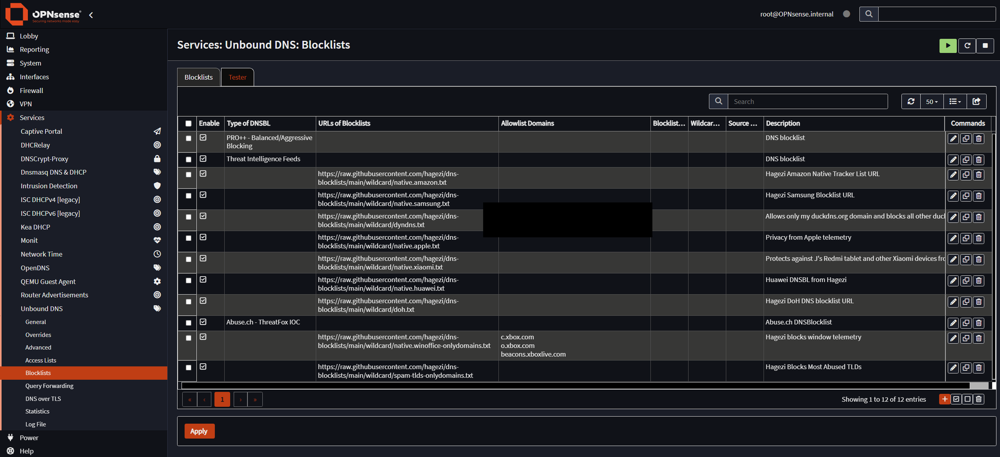

# Investigation: Devices Bypassing My Local DNS

**Author:** Romel Dawson
**Role:** Home lab owner (self-managed)
**System:** OPNsense (transparent-bridge Suricata IPS + Unbound recursive DNS) ahead of a UniFi gateway
**Date:** January 2026

---

## Summary

I run a local Unbound recursive resolver and force every device on the network to use it, so DNS is logged and filtered in one place. This is the investigation that made me build that in the first place.

I went into my Unbound query logs to see what my IoT devices were actually talking to. The logs showed a Samsung TV phoning home to its viewing-tracking servers roughly every five minutes, day and night. While I was blocking those tracking domains at the resolver, I found something more important: one device, an Amazon Fire TV, was ignoring my resolver completely by using a hardcoded public DNS server. Its queries never reached Unbound, so none of my logging or blocking applied to it.

That was the real finding. The problem is not that one TV is chatty. It is that any device can quietly opt out of my DNS control just by hardcoding its own resolver, which makes DNS filtering useless as a control unless it is actually enforced. So I stopped relying on devices to cooperate. I forced all DNS through Unbound with a NAT redirect, and later closed the encrypted side doors (DoT and DoH) a device could use to escape the same way.

---

## Background: why I was reading DNS logs

DNS is the quietest place to see what a device is doing. Before a smart TV or a phone app talks to anything, it has to look up a name, and that lookup passes through the resolver. If every device uses my resolver, the query log becomes a running record of which devices are reaching out to which services.

My setup is built for exactly that: a single Unbound recursive resolver on the OPNsense box, with the IoT devices on their own VLAN. I wanted to use that log to answer a simple question I had been curious about for a while, which is what my "smart" devices actually phone home about when nobody is using them.

## What I noticed: a TV that never stops talking

The IoT VLAN was busier than I expected, and one device stood out. A Samsung Smart TV was generating a steady stream of lookups to Samsung tracking and analytics domains, and to a third-party ad network, around the clock, whether or not anyone was watching it.

The domains it was contacting, from the resolver log:

| Domain | Queries | Purpose |
|---|---|---|
| `log-ingestion-eu.samsungacr.com` | 286 | ACR viewing tracking |
| `osb-v1-alb.samsungqbe.com` | 96 | Telemetry |
| `acr-eu-prd.samsungcloud.tv` | 40 | Content recognition |
| `tvx.adgrx.com` | 50 | Third-party ad network |
| `www.facebook.com` | 32 | Facebook |
| `lcprd1.samsungcloudsolution.net` | various | Samsung cloud |

The one that stood out was `log-ingestion-eu.samsungacr.com`. The TV was hitting it roughly every five minutes, continuously, regardless of whether the TV was actually in use.

That endpoint is part of ACR. Automatic content recognition is how a smart TV works out what is on the screen: it samples the picture or audio, turns the sample into a fingerprint, and sends the fingerprint back to the manufacturer to be matched against a database. It runs on whatever is on screen, including things plugged into the HDMI ports, not just the TV's own apps. So the five-minute callbacks are the TV reporting viewing activity home on a schedule.

## How I investigated

This was all done from the Unbound query logs. I broke the IoT VLAN down by device and looked at which domains each one was contacting and how often, over a week of logs.

| Device | DNS queries (1-8 Jan) | Note |
|---|---|---|
| Apple TV / HomePod | 3,752 | Normal app and update traffic |
| Amazon Fire TV | 3,431 | Bypassing the local resolver (see below) |
| Samsung Smart TV | 1,068+ | Heavy ACR and telemetry traffic |
| Formuler Z11 Pro Max | 134 | Android TV box, quiet |
| Netflix device | 3,085 | Chatty, but going through the resolver |

The query counts on their own were just noise levels. The interesting part appeared when I tried to act on them.

## What I found: a device ignoring the resolver entirely

When I started null-routing the Samsung tracking domains at Unbound, the blocks worked for the TV but I wanted to confirm they would hold for every device. Checking the logs after the fact is what exposed the actual hole: the Amazon Fire TV barely appeared in them in the way I expected, and the domains I was blocking were still resolving for it.

The reason was simple. DHCP hands every device the address of the local resolver, but DHCP is only a suggestion. A device is free to ignore it and talk to whatever DNS server it likes. The Fire TV did exactly that. It had Google's public resolver (`8.8.8.8`) hardcoded and used it regardless of what DHCP told it. Every DNS query from that device went straight out to Google, so it never showed up in my logs and not one of my domain blocks touched it.

The uncomfortable part is the general case. If one consumer device ships like this, any device can, and a tracker or a piece of malware on the network certainly would, because bypassing the local resolver is the obvious way to dodge DNS-based blocking. DNS filtering that a device can opt out of is not a control. It is a convenience for the devices that happen to cooperate, and the ones you most want to watch are the ones least likely to.

## What I changed: stop asking, start forcing

The fix is to stop treating the local resolver as a request and start enforcing it.

I added a destination-NAT rule on the IoT VLAN that intercepts any DNS query, anything heading to port 53, and rewrites the destination to my Unbound resolver no matter what the device originally aimed at. The Fire TV still believes it is talking to `8.8.8.8`. It is actually talking to my resolver. Nothing changes on the device, and there is no setting on it for the device to get wrong.

| Setting | Value |
|---|---|
| Type | Destination NAT |
| Interface | IoT VLAN |
| Protocol | TCP / UDP |
| Source port | Any (deliberately *not* 53) |
| Destination port | 53 |
| Redirect to | the local Unbound resolver (`192.168.███`) |

One detail matters here. The rule matches on destination port 53 with the source port left as any. It is tempting to also pin the source port to 53, but devices send DNS from a random high source port, so matching on the source port would miss almost every query. The match has to be "anything going to port 53", not "anything coming from port 53". Getting that backwards is the easy way to write a redirect that looks right and catches nothing.

I confirmed the rule was actually catching traffic by watching its packet counters climb, a couple of thousand redirected packets within a short window, which meant devices were being transparently bounced to the local resolver instead of reaching the outside one.

Forcing everything through Unbound immediately surfaced a resolver problem I had not noticed before. Some Google and YouTube names started failing with `SERVFAIL`. I traced it to Strict QNAME Minimisation, a privacy feature in Unbound that sends only the minimum part of a name to each nameserver; a few nameservers handle minimised queries badly and return failures. Turning off the strict mode fixed resolution. I left DNSSEC validation on. Only the strict QNAME setting came off.

With every device genuinely behind the resolver now, the domain blocks finally applied to everything. I null-routed the Samsung tracking and ACR domains at Unbound (returning `0.0.0.0`, wildcarded so subdomains are caught too) and turned ACR off in the TV's own settings as a second layer. The five-minute callbacks stopped.

## Where this led: closing the encrypted routes

Forcing port-53 DNS handled the plaintext bypass, but a NAT redirect on port 53 only catches DNS that looks like DNS. A device can still try to escape by encrypting its lookups, so closing the plaintext route on its own just pushes a determined device onto the encrypted ones. I closed those too.

**DNS over TLS (DoT).** DoT runs on its own dedicated port, 853. I block that port outbound, so a device cannot open a DoT session to an external resolver.

**DNS over HTTPS (DoH).** DoH is the harder case, because it hides DNS inside ordinary HTTPS on port 443. I cannot simply block the port without blocking the web. I close it in two places that cover the same providers from both directions:

- The **UniFi firewall** drops outbound traffic to the IP addresses of known DoH providers, using the Hagezi DoH IP blocklist. This catches a device that tries to reach a DoH endpoint directly by address.
- **Unbound's DNSBL** refuses the DoH provider domain names, using the same Hagezi DoH list in its domain form. A DNSBL blocks names rather than addresses, so this is the name-based counterpart to the firewall's address-based block: a device that tries to look up a DoH endpoint by name gets nothing back.

Together those mean a device cannot reach a DoH server by name or by address. The screenshot below is the Unbound side doing the name half of that, with the Hagezi DoH list loaded alongside the per-vendor tracker lists and a couple of threat-intelligence feeds.

<div align="center">

</div>

Those per-vendor lists are also where the Samsung story ended up. The handful of manual overrides I added during the investigation were a fine first response, but I later replaced them with the maintained Hagezi per-vendor tracker lists (Samsung, Amazon, Apple, Xiaomi, Huawei and others), so the blocking stays current without me hand-editing domains every time a vendor adds a new endpoint.

## Outcome

The forced-DNS approach started on the IoT VLAN, where the problem showed up, and I then applied it across every VLAN, including the VPN. The end state is the one described on my [network architecture page](network-architecture.md): every device uses the local resolver whether it wants to or not, the plaintext and encrypted bypass routes are both closed, and as a result the blocklists are genuinely enforced and the DNS logs are complete, because nothing on the network resolves a name without going through Unbound.

That last point is what I actually set out to get. The visibility I started this investigation with is now reliable rather than best-effort: the logs show everything, because there is no longer a way around them.

---

## Appendix: where I looked and how I confirmed it

```bash
# Unbound resolver query logs (per-client DNS activity)
/var/log/resolver/resolver_*.log

# See what a given device is asking for
sudo grep '<device-ip>' /var/log/resolver/resolver_*.log | less

# Count how often the TV hit its ACR endpoint over the captured logs
sudo grep -c 'log-ingestion-eu.samsungacr.com' /var/log/resolver/resolver_*.log

# Confirm the DNS redirect is actually catching traffic (packet / byte counters
# on the NAT rule should climb as devices are bounced to the local resolver)
sudo iptables -t nat -L -v -n | grep ' 53'
```

The redirect counters climbing (a couple of thousand packets, ~141 KB, in a short window) was the proof that devices with their own DNS settings were being transparently sent to my resolver instead of reaching the outside one.

---

*Note: internal IP addresses and identifiers have been redacted or generalised for publication.*
