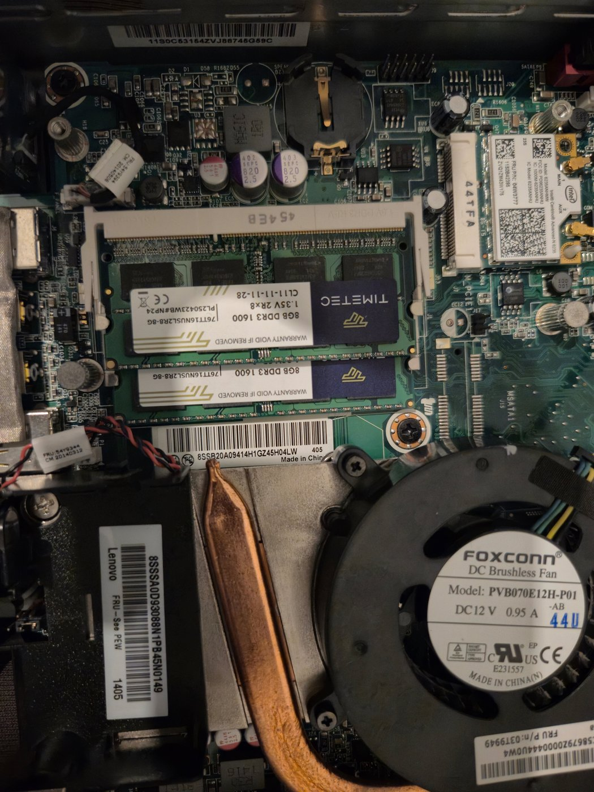
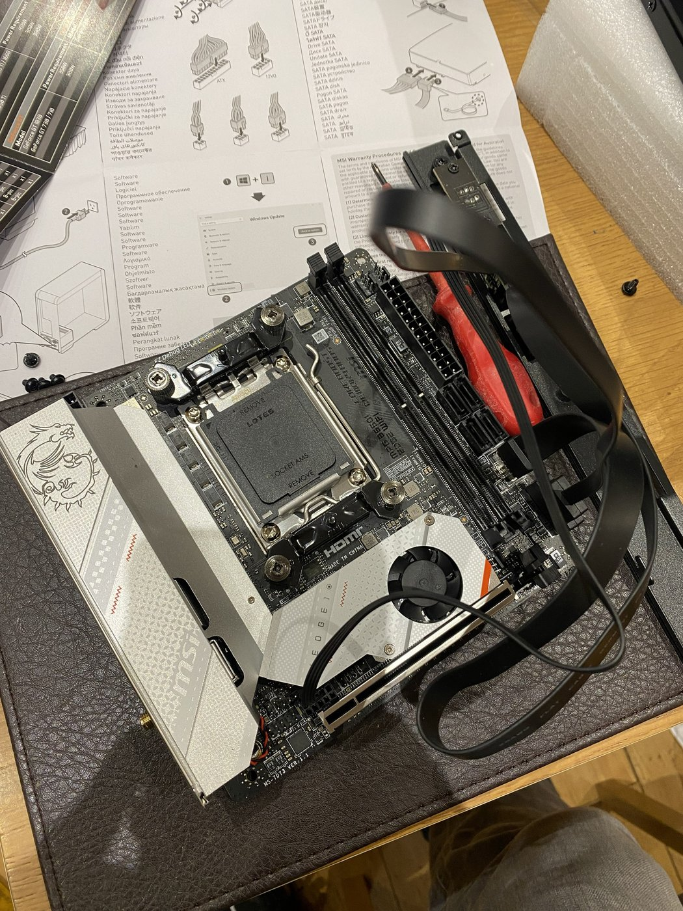
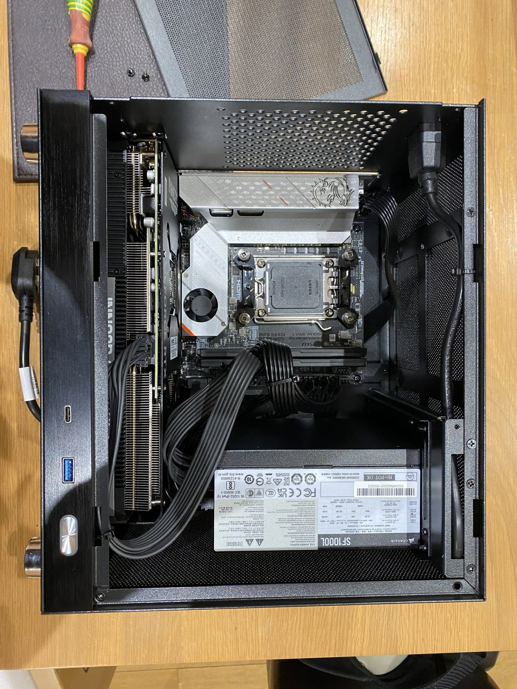
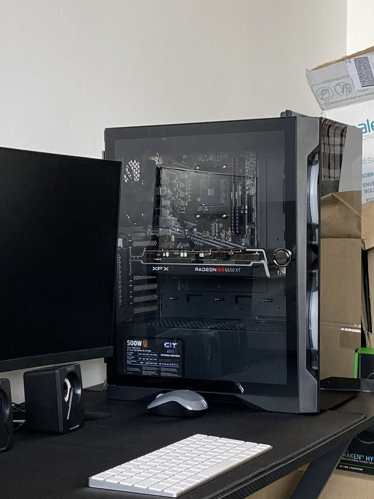
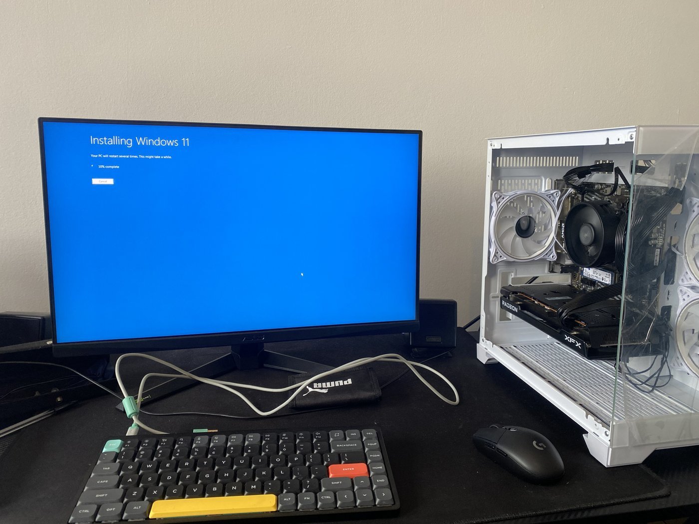

# Hardware: Builds, Upgrades & Repairs

Machines I've built, upgraded or repaired. Most of these run as nodes on my home network. One was a full build for a friend.

**Lenovo ThinkCentre M93p, brought back from scrap.** This started as an enterprise desktop that had reached end of life and been decommissioned. It arrived with no drive (the original was destroyed at disposal), no RAM, no power supply, and only a basic dual core CPU. I sourced a second hand quad core i7 along with RAM, an SSD and a PSU, all cheaply. It was packed with dust, so I stripped it down, cleaned it out, applied fresh thermal paste, and installed Proxmox. It now runs as a virtualisation node on my network.

**Mini-ITX build, in progress.** Seating the MSI B650I board and AM5 processor partway through assembling my main system.

**The same build, finished.** Components installed and cables routed in a compact ITX case. This is my main machine (currently a Ryzen 9 9950X3D, 96GB DDR5 and an RTX 4070 Ti Super), which I use to self host a large language model locally.

**A full desktop build, now a node on my network.** A complete system I assembled and set up, running as a family machine on my network (XFX Radeon RX 6650 XT).

**A full build for a friend.** A complete machine I built and set up for someone else, pictured partway through the Windows 11 install.
