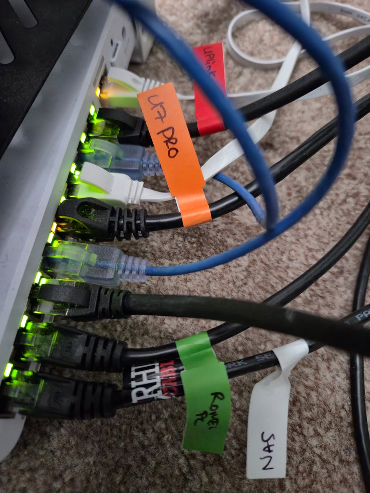
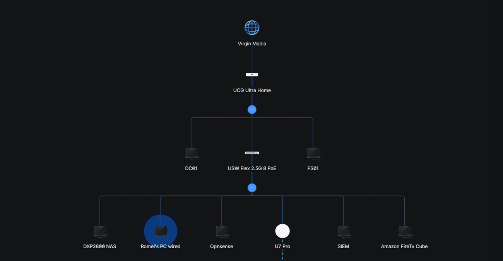
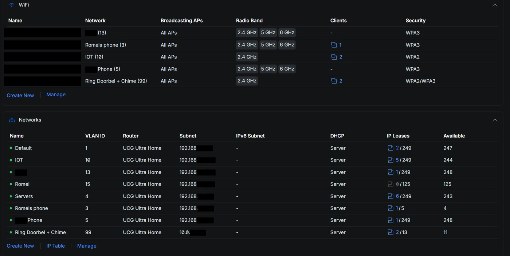
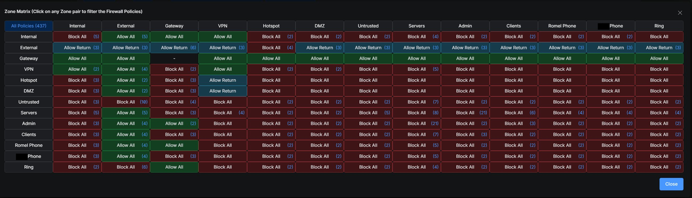
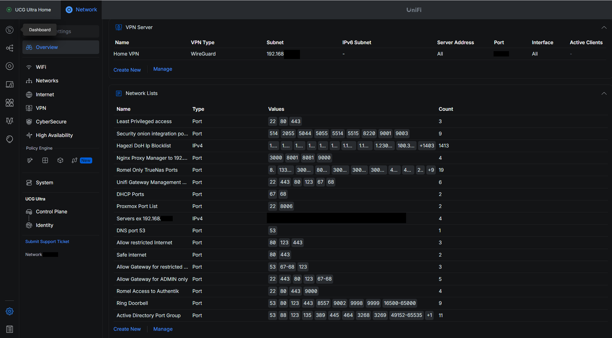

# Home Network & Security Architecture

A segmented, monitored home network I run as a hands-on learning environment. The internet feed is inspected inline before it reaches the gateway, traffic is split across isolated VLANs with a default-deny firewall between them, and the network is monitored by a SIEM.

> In the screenshots below, IP addresses are blanked after the first two octets and SSID names are removed.

## The hardware

| Host | Hardware | Role |
|---|---|---|
| **Edge IPS / DNS** | Mini-PC, Intel N150, 8 GB DDR5, 128 GB SSD | OPNsense (bare metal): Suricata IPS in transparent-bridge mode, Unbound full recursive DNS, and network NTP |
| **Gateway** | UniFi Cloud Gateway Ultra | Routing, zone-based firewall, UniFi controller |
| **Switch** | UniFi USW Flex 2.5G 8 PoE | Core switching and PoE |
| **Virtualisation host** | Lenovo ThinkCentre M93p Tiny, quad-core i7, 16 GB RAM | Proxmox running 3 VMs: 2x Windows Server 2025 (domain controller and file server for AD practice) and Authentik (SSO / identity) |
| **SIEM** | CWWK fanless mini-PC, AMD Ryzen 5 (5500), 32 GB DDR5, 2 TB SSD | Security Onion (network security monitoring) |
| **Storage** | UGreen DXP2800, 16 GB RAM, 1 TB SSD + 2x 18 TB HDD (RAID mirror) | TrueNAS Scale hosting Nextcloud and Immich (self-hosted cloud) |
| **Wi-Fi** | UniFi U7 Pro | Wireless AP, a separate SSID per VLAN |

During a heatwave the SIEM's SSD twice hit critical temperature and dropped offline. I traced it to a thermal problem and fitted a temperature-triggered 120 mm fan that spins up above a set threshold. No dropouts since. (Full writeup: [Thermal NVMe Failure on a Home SIEM](siem-thermal-incident.md).)

Patch cables are labelled at the switch for quick tracing:

## Network architecture

The network topology in the UniFi console:

## Design notes

**Inline IPS ahead of the gateway.** The ISP modem runs in bridge mode and passes traffic to a bare-metal OPNsense box configured as a transparent bridge. Suricata inspects that traffic in IPS mode and can drop malicious packets before they reach the gateway, rather than only detecting them after the fact.

**Controlled DNS everywhere.** A local Unbound resolver performs full recursive DNS for every query on the network. DNS is forced with a NAT redirect on every VLAN, including the VPN VLAN, so every device uses the local resolver whether it wants to or not. Some devices ship with hardcoded encrypted DNS that tries to bypass a local resolver, so I close those routes too: DNS-over-TLS is blocked on port 853, and DNS-over-HTTPS is blocked by dropping traffic to known DoH endpoints using the Hagezi DoH IP blocklist, which is the encrypted bypass route over 443. A device that tries to bypass is transparently redirected back to my resolver without anything changing on its end. The result is that only permitted names resolve, DNS blocklists are actually enforced, and the DNS logs are complete because nothing slips past. I added this after an investigation showed some devices were quietly bypassing my DNS, which is how I came to learn about NAT redirect and implement it in the first place.

**Segmentation and default-deny firewall.** Traffic is split across purpose-built VLANs (servers, monitoring, trusted users, mobile, IoT, smart cameras, guest). A zone-based firewall enforces least privilege between zones: the default is block, and only the specific flows that need to exist are allowed. IoT and camera devices are isolated so a compromised device cannot reach the rest of the network.

The VLANs and per-network DHCP, with IP ranges and SSID names redacted:

The zone-to-zone firewall policy matrix:

**Least privilege, enforced per service.** Because the firewall is deny-by-default, nothing is allowed until I explicitly permit it. Rather than open broad ranges, I build a named port group for each service containing only the ports it actually needs, then write a rule scoped to that group, so every allow rule is the minimum access necessary. The network lists below are those port groups: standard service ports, named by purpose.

**Monitoring.** A Security Onion SIEM collects logs and gives visibility into activity across the network.

**Identity and services.** Authentik provides single sign-on for self-hosted apps. TrueNAS (mirrored disks for redundancy) backs Nextcloud and Immich, my self-hosted replacements for cloud file and photo storage.
