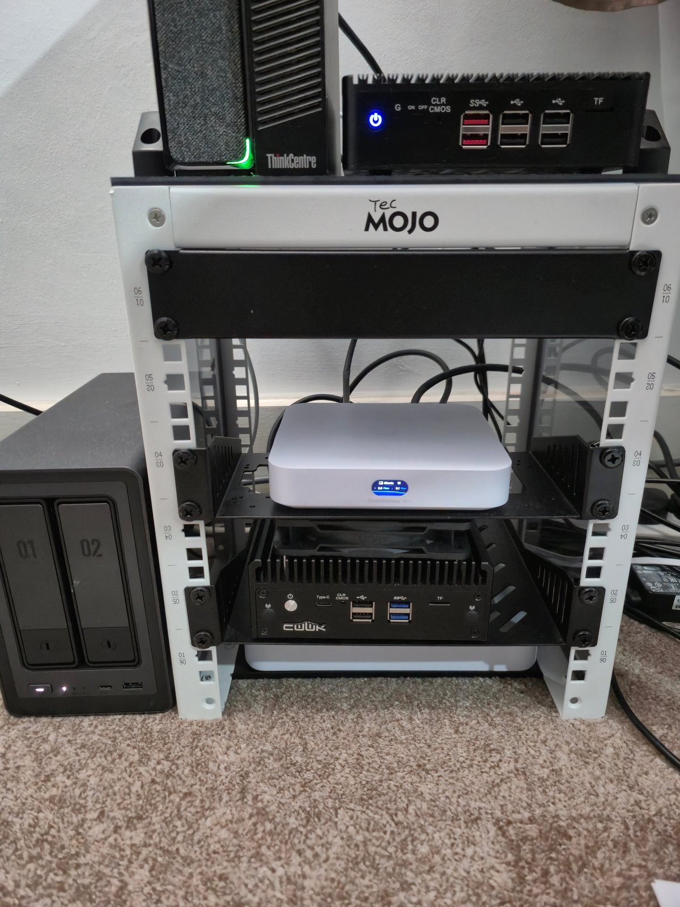
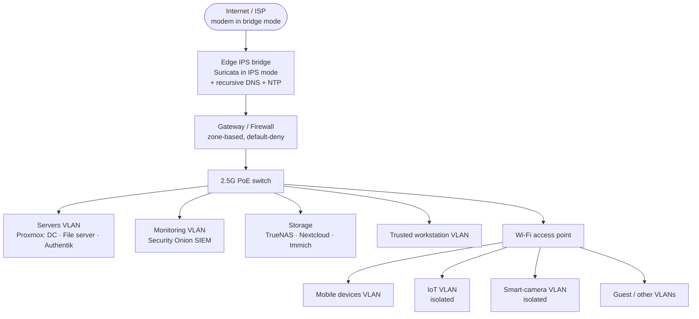

# Home Network & Security Architecture

A segmented, monitored home network I designed and run as a hands-on learning environment. The internet feed is inspected inline *before* it reaches the gateway, traffic is split across isolated VLANs with a default-deny firewall between them, and the whole network is watched by a SIEM.

> Real IP ranges, subnets, SSIDs and personal device names are intentionally omitted. The diagram and tables below are sanitised on purpose.

## The hardware

| Host | Hardware | Role |
|---|---|---|
| **Edge IPS / DNS** | Mini-PC · Intel N150 · 8 GB DDR5 · 128 GB SSD | OPNsense (bare metal): **Suricata IPS in transparent-bridge mode**, **Unbound** full recursive DNS, and network NTP |
| **Gateway** | UniFi Cloud Gateway Ultra | Routing, **zone-based firewall**, UniFi controller |
| **Switch** | UniFi USW Flex 2.5G 8 PoE | Core switching + PoE |
| **Virtualisation host** | Lenovo ThinkCentre M93p Tiny · quad-core i7 · 16 GB RAM | **Proxmox** running 3 VMs — 2× Windows Server 2025 (domain controller + file server for AD practice) and **Authentik** (SSO / identity) |
| **SIEM** | CWWK fanless mini-PC · AMD Ryzen 5 (5500) · 32 GB DDR5 · 2 TB SSD | **Security Onion** — network security monitoring |
| **Storage** | UGreen DXP2800 · 16 GB RAM · 1 TB SSD + 2× 18 TB HDD (RAID mirror) | **TrueNAS Scale** hosting **Nextcloud** + **Immich** (self-hosted cloud) |
| **Wi-Fi** | UniFi U7 Pro | Wireless AP, a separate SSID per VLAN |

> **A real fix from running this:** during a heatwave the SIEM's SSD twice hit critical temperature and dropped offline. I traced it to a thermal problem and fitted a temperature-triggered 120 mm fan that spins up above a set threshold — no dropouts since. A small mod, but it's exactly the diagnose-the-root-cause-then-fix-it work that real support is made of.

## Network architecture

*GitHub renders this diagram automatically — it's text, so there's no image to host and it's easy to edit.*

## Design highlights

**Inline IPS ahead of the gateway.** The ISP modem runs in bridge mode and passes traffic to a bare-metal OPNsense box configured as a *transparent bridge*. Suricata inspects that traffic in IPS mode and can drop malicious packets *before* they reach the gateway — inline prevention, not just passive detection after the fact.

**Controlled DNS everywhere.** A local Unbound resolver performs full recursive DNS. DNS is then *forced* network-wide using a NAT redirect on every VLAN — including the VPN VLAN — so no device can quietly use its own resolver. That's a real security control: it stops DNS being used to bypass filtering or to exfiltrate data.

**Segmentation + default-deny firewall.** Traffic is split across purpose-built VLANs (servers, monitoring, trusted users, mobile, IoT, smart cameras, guest). A zone-based firewall enforces least privilege *between* zones — the default is block, and only the specific flows that need to exist are allowed. IoT and camera devices are isolated so a compromised gadget can't reach anything important.

**Monitoring.** A Security Onion SIEM gives visibility into what's actually happening on the network — the same detect-and-investigate workflow a SOC uses.

**Identity & services.** Authentik provides single sign-on for self-hosted apps; TrueNAS (mirrored disks for redundancy) backs Nextcloud and Immich, my private replacements for cloud file and photo storage.

## What this demonstrates

VLANs and network segmentation, firewall rule design and least privilege, IDS/IPS with Suricata, DNS architecture and hardening, SIEM-based monitoring, virtualisation with Proxmox, SSO / identity, storage with redundancy — and, throughout, a security-first mindset and the habit of documenting and troubleshooting a real, running system.
